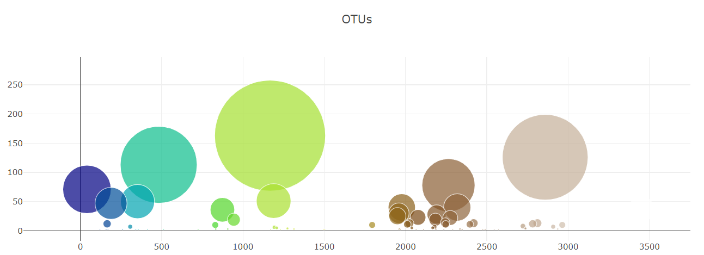

# belly-button-challenge
Module 14 Challenge for the Vanderbilt Data Analytics Bootcamp




# Code from Other Sources
The following code was adapted from [this page](https://plotly.com/javascript/bubble-charts/) and [this page](https://plotly.com/javascript/colorscales/). 
```
let trace1 = {
            x: xticks,
            y: yticks,
            text: otu_labels,
            mode: "markers",
            // https://plotly.com/javascript/bubble-charts/
            // https://plotly.com/javascript/colorscales/
            marker: {
                size: sample_values,
                color: otu_ids,
                colorscale: "Earth"
            }
        }
```

The following code was adapted from [this page](https://stackoverflow.com/questions/54651873/how-to-map-key-value-pairs-of-a-map-in-javascript).
```
Object.entries(value[0]).map(([key,value]) => {
        // append each key, value pair to the div that corresponds to id="sample-metadata"
        d3.select("#sample-metadata").append("p").text(`${key}: ${value}`);
    });
```